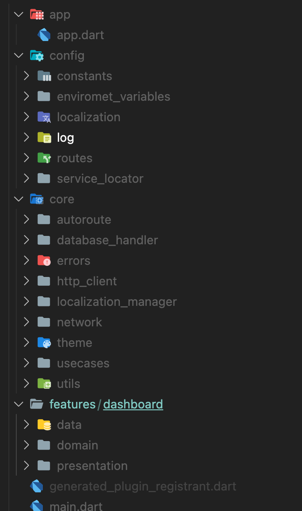

# Narad - News App Representing All Dimensions

A showcase news app with flutter and best practises I learned along the way. Of course this is not the perfect example of creating flutter app. so you are welcome to suggeset the better way to do things.

### Features in the app
- [x] Localization using flutter_localization
- [x] Dynamic Theme
- [x] Caching the api response
- [x] Save Favorite Article Locally
- [x] Clean Code Architecture


### How to build & run: 

```bash
flutter pub get && flutter pub run build_runner build --delete-conflicting-outputs #fetch the packages and run build_runner to generate necessary files [localization, routing ]
```
```bash 
flutter run -d device-name #run on specific device
```
```bash 
flutter build apk #for android
```

```bash
flutter build ipa #for iOS
```

### Visual Demo


### Folder Structure



This app showcases following packages use in production app:

- [x] AutoRoute
- [x] cached_network_image
- [x] connectivity_plus
- [x]  flutter_bloc
- [x] flutter_localizations
- [x] get_it
- [x] google_fonts
- [x] hive
- [x] intl
- [x] path_provider
- [x] share_plus
- [x] shared_preferences
- [x] timeago
- [x] webview_flutter
